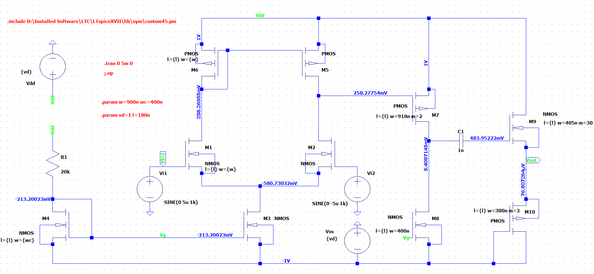

# LTSpice Analog Electronics Project

Designed an Operational amplifier(Op-Amp) using Operational transconductance amplifier (OTA). Implemented the design with 45nm PTM model.

**Folder structure:**

- LTSpice_Files: Contains LTSPice circuit files
- LTSpice_Files->OTA_Only.asc: Contains the circuit for the OTA used for making the Op-Amp
- LTSpice_Files->OpAmp.asc: Contains the circuit for the final Op-Amp designed using the OTA
- Report.PDF : Contains detailed report of the project and its results

**Software used in this project:** LTSpice

**Technology used in this project:** 45-nm PTM models downloaded from https://ptm.asu.edu/

## How to use the PTM model to run simulations?

1. Download LTSpice from https://www.analog.com/en/design center/design tools
   and calculators/ltspice simulator.html
2. For downloading PTM files go to http://ptm.asu.edu/latest.html (65 nm V1.0
   models)
3. Open notebook in your computer. Copy the file from the opened link and paste in
   the notebook. Change the name of the model to a different name.
4. Save the file.
5. Copy and paste the file in LTSpice->Lib->Sym
6. Copy the path of the file after pasting it.
7. Open LTSpice . Open new schematic. Click .op from task bar. Write the command:
   .include <file path>.<filename.
8. Press enter. Put the text on the top of your schematic.

## Procedure to follow in LTSpice

- Using .op command : For viewing dc operating currents and voltages.
- Using .ac command
  - For ac analysis of the circuit
  - Syntax: .ac<oct, dec , lin > Npoints > StartFreq > EndFreq
- Using . meas command
  - Syntax: . meas AC name FIND expr WHEN/AT expr = condition
  - Syntax: . meas OP name PARAM < expr>

Note: .meas command is to be used along with .op / .ac command (Applicable analysis)

## How to run the designed circuit?

1. Download and install LTSpice as mentioned above
2. Go into the 'LTSpice_Files' folder
3. Run the 'OpAmp.asc' with LTSPice and run the simulation to view the results

## Snapshots of the Op-Amp Circuit

### Circuit

  

### Differential Gain

  
Differential gain(Ad) = Vout/Vi = 49.094043/10 \*1000 = **4909.4**

### Common Mode gain

Common Mode Gain= Acm = Vout / Vi1 = **0.909**
